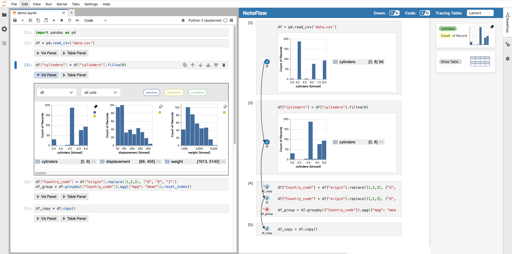
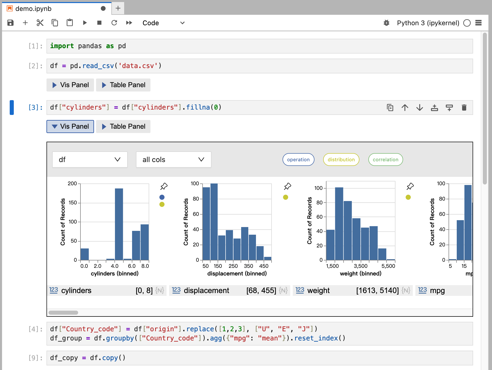
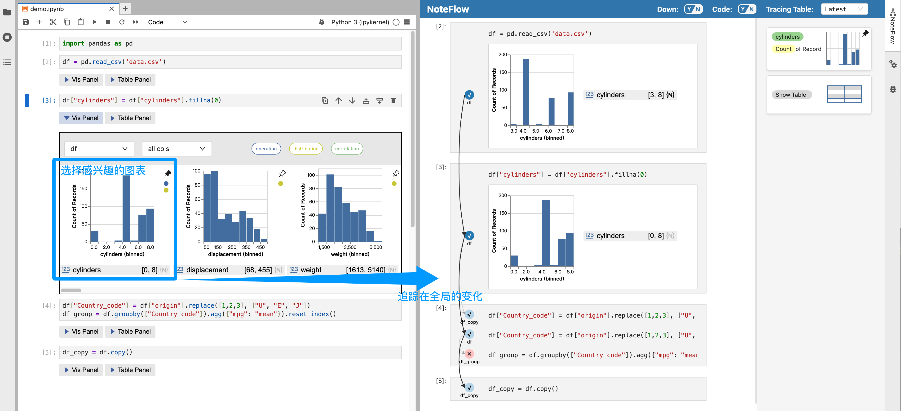

# Noteflow 📝

> **Noteflow** 是一款 JupyterLab 扩展，专门针对 DataFrame 数据表。每在 Notebook 中运行完一个单元格，它都会根据该单元格执行后的数据状态推荐合适的可视化图表，并支持将某些图表固定为“观察窗口”，以持续跟踪数据在整个过程中的变化。



---

## 🌟 主要功能

Noteflow 提供两个核心功能：图表推荐与数据流追踪。

* 📊 **图表推荐**：为每个cell的dataframe数据表提供可视化推荐，帮助用户理解数据在这个cell的状态。



* 🔍 **数据流追踪**：基于前面的推荐，用户可以从中选择感兴趣的可视化图表，并在整个数据流中对其进行追踪，从而看到在这个可视化图表的视角下，数据状态是如何发生变化的。



[▶ 下载demo视频](https://github.com/bebinca/NoteFlow-Test/demo.mp4)


<!-- ---

## ⚙️ 环境要求

在安装和使用 Noteflow 前，请确保环境满足以下条件：

* **Python**: >= 3.8
* **JupyterLab**: >= 4.0.0, < 5
* **Node.js**: 18.x
* **依赖**：

  * `jupyter_server`: >= 2.0.1, < 3
  * `altair`: >= 5.4.1
  * `scikit-learn`: >= 1.5.2
  * `pandas`: >= 2.2.2 -->

---

## 📦 安装并使用

安装测试版本：

```bash
pip install -i https://test.pypi.org/simple/ noteflow==0.1.0
```

安装完成后，启动 JupyterLab：

```bash
jupyter lab
```

使用方法：

1. 打开 JupyterLab 后，你会在右侧看到 **NoteFlow** 按钮，点击即可打开插件界面。
2. **注意**：当前版本在以下情况可能需要**刷新浏览器页面**后再使用：
   * 启用插件
   * 切换到其他 Notebook
   * 重启 Notebook 内核
此问题正在修复中。
3. 你可以使用`test`文件夹下提供的示例数据和 Notebook 来测试插件功能。

---

## ⚠️ 已知问题与待完善功能

* **循环支持**：当前在 `for` 循环中，每次循环内的 DataFrame 变化都会被单独记录。如果循环次数过多（如 10,000 次），会生成大量可观察状态的 DataFrame，导致卡顿甚至无响应。此功能正在优化中。
* **条件语句支持**：暂不支持在 `if` 语句中对 DataFrame 状态进行记录。
* **特殊表头处理**：当数据表的列名（表头）包含单引号 `'` 时，可能会引发错误，修复中。
* 部分情况下需要刷新浏览器才能正常使用。

---

## 🔧 其他常见问题

* **前端扩展已安装但不工作**
  检查服务端扩展：

  ```bash
  jupyter server extension list
  ```

  检查前端扩展：

  ```bash
  jupyter lab extension list
  ```

---
<!-- 
## 🛠 开发环境搭建

**推荐**：为 Noteflow 创建单独的 Conda 环境，并确保 Node.js >= 18。

```bash
conda create -n noteflow python=3.11 jupyterlab=4
conda activate noteflow
pip install -ve .
```

### 开发模式安装

```bash
# 克隆仓库到本地
# 进入 noteflow 目录
# 开发模式安装 Python 后端
pip install -ve .

# 关联当前开发版本的前端扩展
jupyter labextension develop . --overwrite

# 手动启用服务端扩展
jupyter server extension enable noteflow

# 构建前端 TypeScript 源码
jlpm build
```

### 热加载（Hot Reload）

```bash
# 一个终端中监听源码变化
jlpm watch

# 另一个终端启动 JupyterLab
jupyter lab
```

源码变化会自动触发重建，刷新浏览器即可看到更新。

---

## 🧪 测试

### 服务器端测试（Python）

```bash
pip install -e ".[test]"
pytest -vv -r ap --cov noteflow
```

### 前端测试（Jest）

```bash
jlpm
jlpm test
```

### 集成测试（Playwright + Galata）

```bash
jlpm playwright test
``` -->

<!-- --- -->

